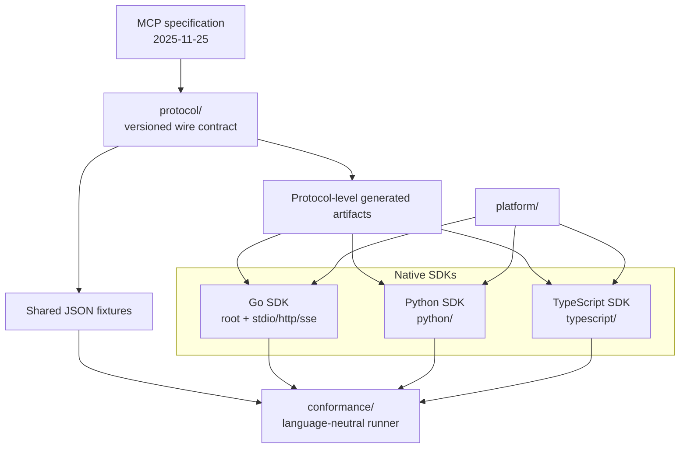
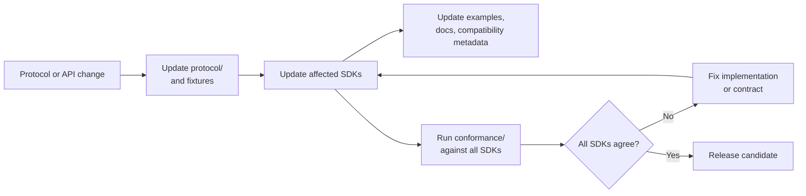
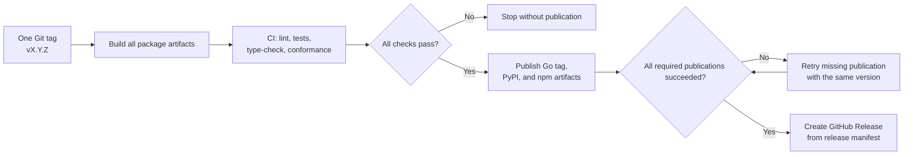

# Roadmap: polyglot MCP platform

## Goal

Evolve the current `go-mcp` repository into a product monorepo in which the
Go, Python, and TypeScript MCP SDKs and the platform are released as one
versioned product. The protocol contract and conformance suite are shared;
the language APIs remain idiomatic and independently implemented.

## Architectural decisions

- Keep this repository as the monorepo instead of splitting the SDKs into
  separate repositories.
- Keep the root Go module path `go.osspkg.com/mcp` and the existing Go package
  boundaries. Do not move the Go module into a nested module unless a separate
  migration decision approves the tag and import-path consequences.
- Add language SDKs as native packages under `python/` and `typescript/`.
  Python and TypeScript code must not execute the Go SDK through a subprocess or
  make the platform depend on a Go runtime.
- Keep `protocol/` as the versioned source for wire schemas, protocol metadata,
  and cross-language fixtures. Generate only protocol-level artifacts; do not
  generate the complete high-level SDK API.
- Keep `conformance/` independent from any one SDK. The same scenarios must be
  runnable against Go, Python, and TypeScript servers.
- Separate the MCP protocol revision from the product SDK version. For
  example, `protocol: 2025-11-25` may ship in product version `0.1.0`.
- Use one release manifest and one Git tag for a product release. Package
  publication is a coordinated, retryable workflow, not a transaction: a
  failed registry upload must be resumable without changing the version.

## Target repository shape

```
go-mcp/
├── go.mod                         # go.osspkg.com/mcp
├── protocol/                      # versioned schemas and fixtures
├── conformance/                   # cross-language scenarios and runner
├── python/                        # Python SDK
├── typescript/                    # TypeScript/JavaScript SDK
├── platform/                      # platform applications and integrations
├── example/                       # equivalent examples in each language
├── tools/                         # generation, validation, and release tools
├── release.yaml                   # product and protocol versions
├── PLAN.md                        # active implementation tasks
└── ROADMAP.md                     # milestones and long-term direction
```

## Project diagrams

### Target architecture and package boundaries



The platform depends on public SDK APIs. The SDKs depend on the protocol
contract and shared behavior fixtures, but do not depend on one another or on
the platform.

### Change and conformance flow



A change is not complete when one SDK passes its unit tests; it is complete
only when the shared scenarios produce compatible results for all supported
languages.

### Coordinated release train



Package registries do not provide one cross-registry transaction. The release
workflow therefore builds and verifies everything first, publishes with the
same version, and supports idempotent retries after a partial upload.

The current repository layout remains authoritative until each planned
directory is implemented. Existing root Go files, `stdio/`, `http/`, `sse/`,
`config/`, `client/`, and `example/` retain their current responsibilities.

## Milestones

### M0 — Release and compatibility foundation

- Define package names, ownership, licensing, supported runtimes, and the first
  coordinated product version.
- Add `release.yaml` with the product version, MCP revision, package list, and
  release status rules.
- Document the rule that a protocol revision is not the same as an SDK release.

### M1 — Protocol contract

- Add a versioned protocol directory for the currently supported MCP revision.
- Add canonical JSON-RPC/MCP fixtures for initialization, catalogs, tool calls,
  resources, prompts, errors, cancellation, progress, and notifications.
- Define which fields are generated, which are handwritten, and how generated
  files are checked in CI.

### M2 — Python SDK MVP

- Implement a native Python server API with typed tools, resources, prompts,
  middleware, cancellation, and the supported transports required by the
  platform MVP.
- Add Python examples that cover the same basic behavior as the Go examples.
- Pin the contract revision and run the shared fixtures from Python tests.

### M3 — TypeScript SDK MVP

- Implement a native TypeScript/JavaScript server API with the same protocol
  behavior and an idiomatic registration model.
- Add TypeScript examples and package build/type-check configuration.
- Pin the contract revision and run the shared fixtures from TypeScript tests.

### M4 — Conformance and platform integration

- Build a language-neutral conformance runner that starts each SDK server over
  stdio and the selected HTTP transport.
- Require matching outcomes for success, protocol errors, cancellation,
  authorization, limits, and shutdown scenarios.
- Integrate the platform against package boundaries rather than implementation
  internals.

### M5 — Atomic release train

- Make one CI workflow validate all packages, generated artifacts, examples,
  and conformance scenarios before publication.
- Build all artifacts before publishing any registry package.
- Publish Go, Python, and TypeScript artifacts from one tag and create the
  release only after all required publications succeed.
- Support safe retries after a partial registry failure and publish release
  notes from the shared manifest.

### M6 — Compatibility and maintenance

- Add a compatibility matrix for SDK version, MCP revision, runtime versions,
  and transport support.
- Add automated dependency and generated-artifact update checks.
- Review public APIs, examples, documentation, and release metadata before each
  protocol or product release.

## Out of scope

- A shared cross-language runtime implementation.
- Automatic generation of idiomatic Python or TypeScript business APIs from Go.
- Implicit authentication providers, CORS policy, TLS termination, or business
  storage in the SDKs.
- Treating publication to several package registries as an all-or-nothing
  transaction.

## Success criteria

- One commit and one tag describe a product release across all languages.
- The same conformance scenarios pass for Go, Python, and TypeScript.
- The existing Go import path and runtime constraints remain valid.
- A failed package publication can be retried without creating a second version.
